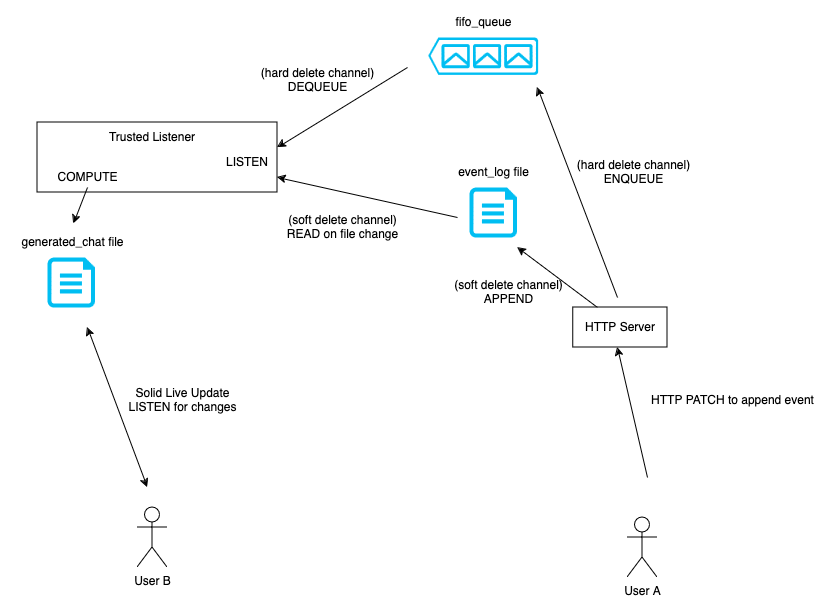
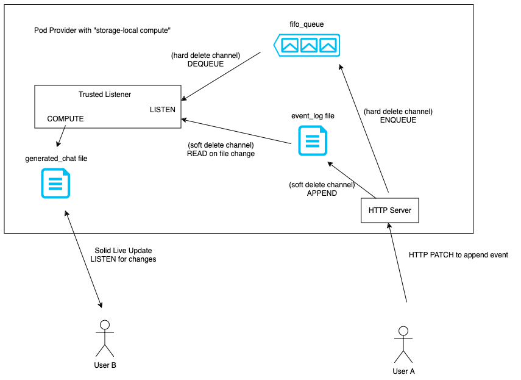
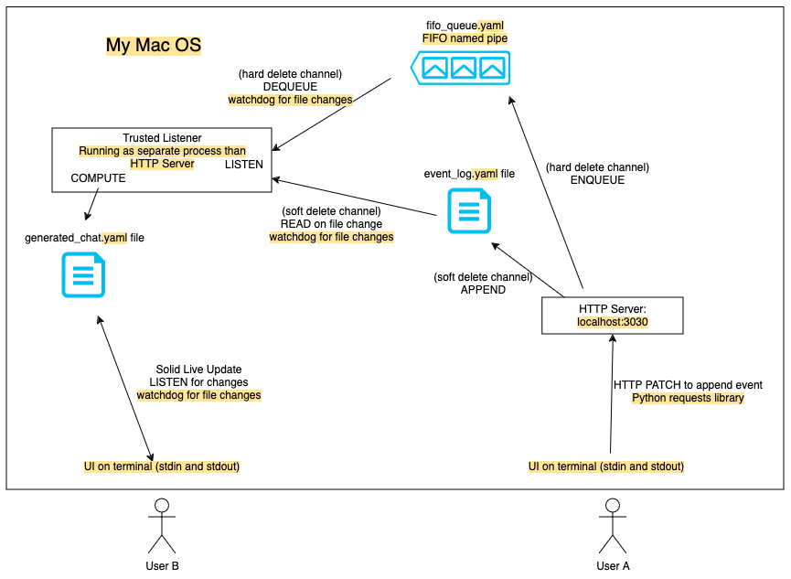
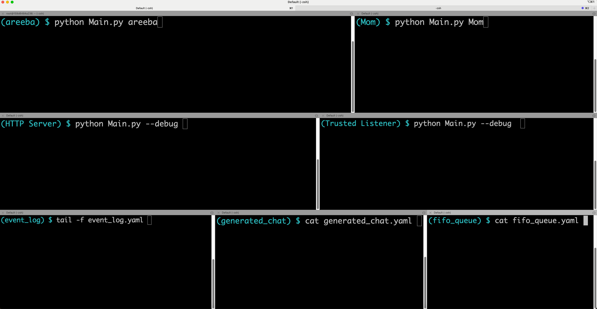

# Exercise: event-based chat

## Contents

1. Overview
2. Demo
3. Ideas

## Overview

### Goals
1. Allow end-users to create channels with the hard delete option
2. Allow custom events that can be interpreted in any way by the UI clients

Notes: 
- hard delete here means no record of the original message on storage
- soft delete means end-users won't have access to the original message, but the original message would still be kept in storage (eg. for auditors - users can enable soft delete channels for security purposes)
- we are ignoring the "data cascading" issue

### How it works

- For every event in the chat, such as `sendMessage`, `deleteMessage`, `editMessage`, `event` (custom events), the client sends an HTTP PATCH with the event details.
- On an HTTP PATCH request, the HTTP server either: 
  - (soft-delete channel) appends the event to an `event_log` file
  - (hard-delete channel) enqueues the event into a FIFO queue `fifo_queue`
- There is a Trusted Listener, trusted by the users to read and generate their chat data. The Trusted Listener: 
  - (soft-delete channel) watches for file changes on the `event_log` file 
  - (hard-delete channel) listens to the `fifo_queue` and dequeues as events arrive
- Upon receiving a new event through either `event_log` or `fifo_queue`, the Trusted Listener re-constructs the `generated_chat` file with the new event data
- The clients have a live connection going to watch for updates on the `generated_chat` file. Eg. Solid Live Update. They update the UI accordingly

With Solid, we can use the concept of "storage-local compute" to keep the components within the Pod Provider as shown below. Or it can also be in a distributed system. 

### Overview of my demo

- clients and server processes run locally on the same host. UI is on a terminal
- it is for illustrative purposes only to demo the concept

### Known issues with the concept

1. Users need to trust the Pod Provider (or a Trusted Listener)
    - for read access to their data (`event_log`)
    - for correctly re-constructing the messages into `generated_chat` => integrity 
2. HTTP PATCH method may have a side effect? Although how the underlying data is stored on the server can be unknown to the client, so maybe it doesn't count as a side effect?
3. Unsure about performance issues - how it may scale or handle high frequency of events. 
    - Optimization needed in the Trusted Listener to efficiently generate the `generated_chat` file based on the latest event
    - Optimization needed in the client UI to efficiently process all events in the generated chat. Eg. Could add another "storage-local compute" component that only sends the diff of the generated chat to the client UI instead of the whole chat. 
4. Trusted Listener is needed to be reliable and always running, otherwise clients will not receive the latest updates. 

## Demo

**If the GIFs are too slow, you can view the videos [here](https://drive.google.com/drive/folders/1oXkHwxQR6xyagbWM3JKwdIMfABKlcmx5?usp=sharing).**

My terminals - what I will run on each pane:

- The top two panes are the two clients
- Middle panes are the server/Pod Provider (HTTP Server and Trusted Listener)
- On the bottom panes we look at the state of the files 

### Soft Delete Demo 

[Link to video](https://drive.google.com/file/d/1luYUodhoWqpHbmsMkwET_ckp2k17WteT/view?usp=drive_link)

- notice that the `generated_chat` gets rid of the original deleted messages, but `event_log` maintains the history

Editing multiple times works as well.

[Link to video](https://drive.google.com/file/d/1r9RqvM4JDzpcaBcdmnXlbgxj3Eexxydd/view?usp=drive_link)

### Hard Delete Demo

[Link to video](https://drive.google.com/file/d/1uydW3ShxBhWwDGZK-VDguQgJS82doIDM/view?usp=drive_link)

- notice that none of `event_log`, `generated_chat`, or `fifo_queue` contain the original deleted message
- there is never anything written to `event_log`
- items placed in `fifo_queue` are immediately processed (& dequeued) by Trusted Listener

### Custom events demo: colour theme!
 
It is very easy to add custom events and have the clients interpret them as needed. 

[Link to video](https://drive.google.com/file/d/1E9Yx3JTfvVfSEtapkA0VC-AiukuKj28j/view?usp=drive_link)

### Group chats demo

Note that for the demo we ignore permissions for additional members to join the chat. 

[Link to video](https://drive.google.com/file/d/1-y1iJ4s8zWHgE9gTA11zwiycqJu2Ui1J/view?usp=drive_link)

## Ideas

### Ideas for custom events

With custom events, users could:
- build custom in-chat games (turn-based mainly, but could add widgets for externally-hosted games?), such as tic-tac-toe, Mastermind, Chess, card games, etc! 
  - for optimization, users can build server-side plugins that would attach to the Trusted Listener and optimize the processing of game events
- store metadata of calls, such as "UserA called UserB at this time"
- share location data in-chat 
- add in-chat reminders/social events 
- etc!

Although I believe the current Solid Chat specs still make "custom events" possible through adding any custom property to a `Message`. 

### Server-side plugins for optimization/special events processing

Users could add server-side plugins to optimize the processing of special events, such as in-chat games. 

### Custom Trusted Listeners

Users could create their own Trusted Listener or choose which community/organization-built Trusted Listener to use. There must be at least 1 Trusted Listener attached, otherwise there will be no updates written to the `generated_chat` file. 

Maybe: Users can add a custom (or community-built) Trusted Listener to do additional actions on a new message? Eg. I send a message to my friend "you owe me $5" and my custom Trusted Listener reads that message as a special event, calls an AWS Lambda function that adds it to a separate database of who owes who how much money. Then my friend could easily say "paid back $5" and the custom Trusted Listener updates accordingly. 
- we may still be able to do this by allowing an app to have read permissions on the `generated_chat` file on our Solid Pod, but there may be other cases where it is better (more optimized) to have a backend plugin that gets triggered on certain events as they occur.
